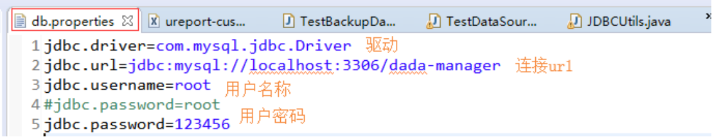
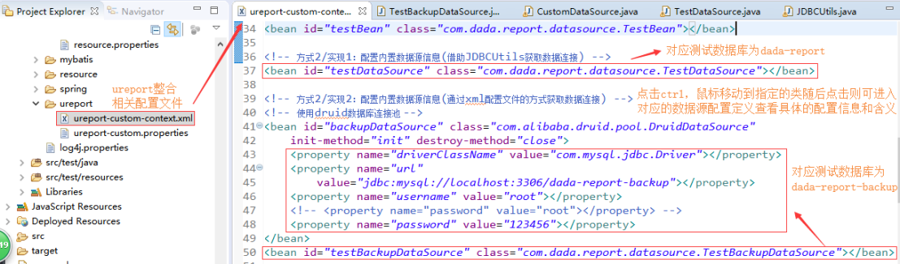
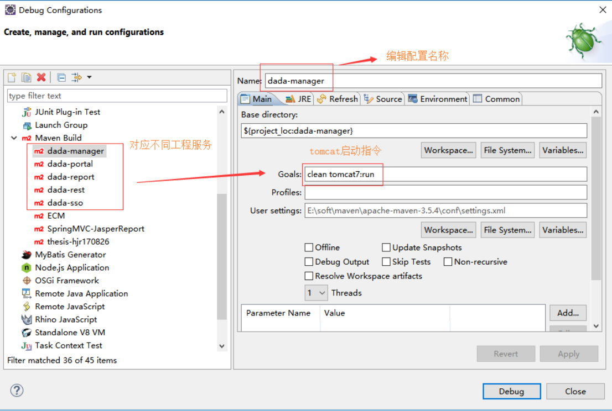

# 项目配置说明

[TOC]

## Maven仓库搭建

​	在搭建好的Maven仓库中引入相关jar，部分jar依赖需要借助开发工具手动导入。如果不希望手动导入jar，则可用已打包好的maven仓库数据，直接复制或替换相关jar即可。

由于此处借助Maven提供的继承概念完成jar依赖的统一管理，搭建了dada-parent工程用于jar的统一管理与维护，如果后续需要对依赖的jar版本进行变动则只需要修改dada-parent工程中pom.xml文件中对应的依赖版本号即可，而不需要对每个工程都进行调整。

## Eclipse运行环境

​	配置eclipse运行环境，将项目导入eclipse中，右键相关工程，选择Maven-->Update Project对相关工程进行更新，等待相关依赖以及配置加载完成。

​	如果在更新过程中出现问题，则需要要考虑环境是否配置正确（例如Maven在eclipse中的配置、jdk配置等），如果是jar依赖引入出错，则可在eclipse选项卡中选择Window-->Show View-->Markers，在Markers选项卡中查看是何种原因引发的更新错误，一步步进行排查即可。

## 数据库配置

​	此处数据库提供了3个sql文件，对应附件有dada-manager.sql、dada-report.sql、dada-report-backup.sql，分别将数据库文件刷入mysql数据库，随后修改相关工程对应的数据库配置。相关数据库连接配置文件均放置在工程对应src/main/resources目录下的config文件下db.properties文件中。resource.properties中则存放一些接口调用配置(如果后续项目启动端口或ip调整，则相应在调用该工程服务的应用中修改相应的配置信息，否则调用出错，触发异常)。

​	db.properties文件中属性配置说明如下：

Sql文件说明如下：

- dada-manager.sql：平台工程主数据库（必刷）

- dada-report.sql：报表测试数据库（可选）

- dada-report-backup.sql：报表测试数据库备份(可选，针对大数据量测试)

​	如果不沿用已提供的报表测试数据库，针对现有部分功能测试的时候可能无法使用或相应报错。用户可根据自身的需求创建相关数据库进行测试。

​	目前在dada-report工程中默认提供了两个用于测试的数据源配置，如果需要使用该数据源配置，则相应刷对应sql文件，并与工程中的数据源配置（dada-report工程对应src/main/resources目录下的ureport文件下ureport-custom-context.xml文件）一一对应。

## 项目启动测试

​	项目启动前首先借助eclipse的terminal窗口进入到指定的工程目录，借助“mvn clean install”指令依次将dada-parent、dada-common、dada-manager三个工程导入指定的maven仓库

​	随后右键相应工程选择run as(直接启动)/debug as(debug模式下启动)，选择maven build-->输入maven指令“clean tomcat7:run”-->确认后启动项目即可。

​	可在相应run或debug图标点击Run Configurations或Debug Configurations查看当前Maven工程启动配置，如下图所示

项目启动说明：

​	dada-sso工程启动：对应可访问单点登录系统(如果要访问相应的业务站点，必须经过单点登录系统完成用户信息登入才能执行下一步操作)

​	dada-manager工程启动：对应可访问后台管理系统

​	dada-rest工程启动：提供公共数据基本操作服务，由dada-portal工程进行调用，如果该服务启动异常，则无法执行对前台报表系统相关数据的基本操作

​	dada-report工程启动：提供报表数据相关操作服务，由dada-portal工程进行调用，如果该服务启动异常，则无法正常提供报表相关功能模块的基本操作

​	dada-portal工程启动：对应可访问前台报表系统

## 操作演示说明

> 访问单点登录系统

访问链接：http://localhost:8083/sso/page/login

登录账号：当前提供了平台管理员登录账号

登录名称-登录密码-机构编号：hahabibu-000000-dada

亦可自行注册一个机构，由机构默认生成对应的用户账号信息，当机构注册完成会对应生成一个管理员角色和对应的用户账号信息，默认为“admin-000000-注册的机构编号”，使用该账号信息便可登录相应的前台报表系统，完成对应前台报表系统的个性化配置。

> 访问后台管理系统

访问链接：http://localhost:8080/manager/page/index

用户必须先进行登录操作，否则页面强制跳转到登录页面

登录完成便可访问相应的后台管理系统链接，执行相关操作

后台管理系统仅仅只能由平台管理员角色进行访问！

> 访问前台报表系统

访问链接：http://localhost:8082/portal/index/home

此处预先创建了一个在机构编号为“zstu”的机构信息，因此可借助其进行演示操作。

机构默认创建的管理员账号：admin-000000-zstu

手动创建的管理员账号：cls-000000-zstu

手动创建的普通机构用户账号：xiaoshazi-000000-zstu、xiaobai-000000-zstu

以不同的角色登录则可相应访问不同的信息，这些信息可由机构管理员进行配置。

具体的操作流程演示可参考提供的视频演示，此处则不作赘述。